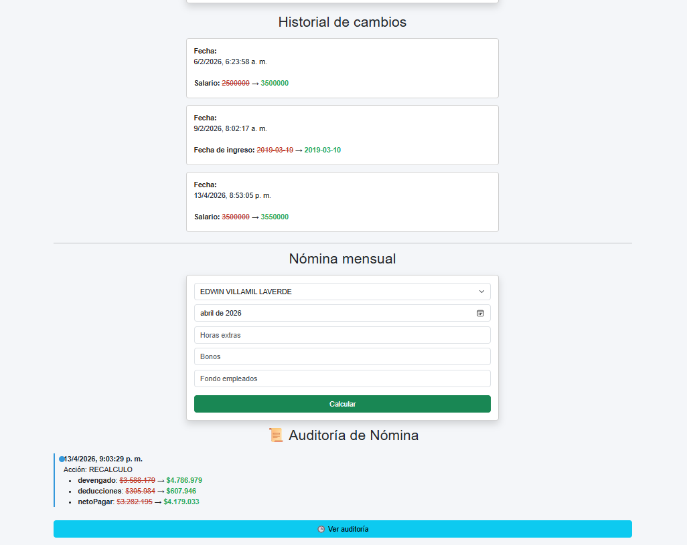
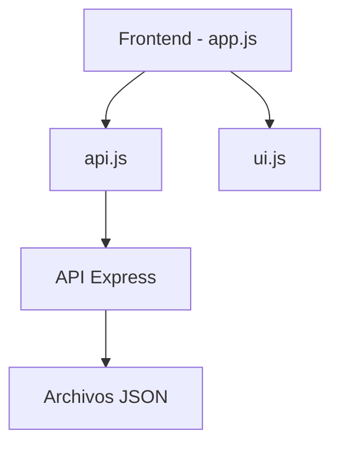
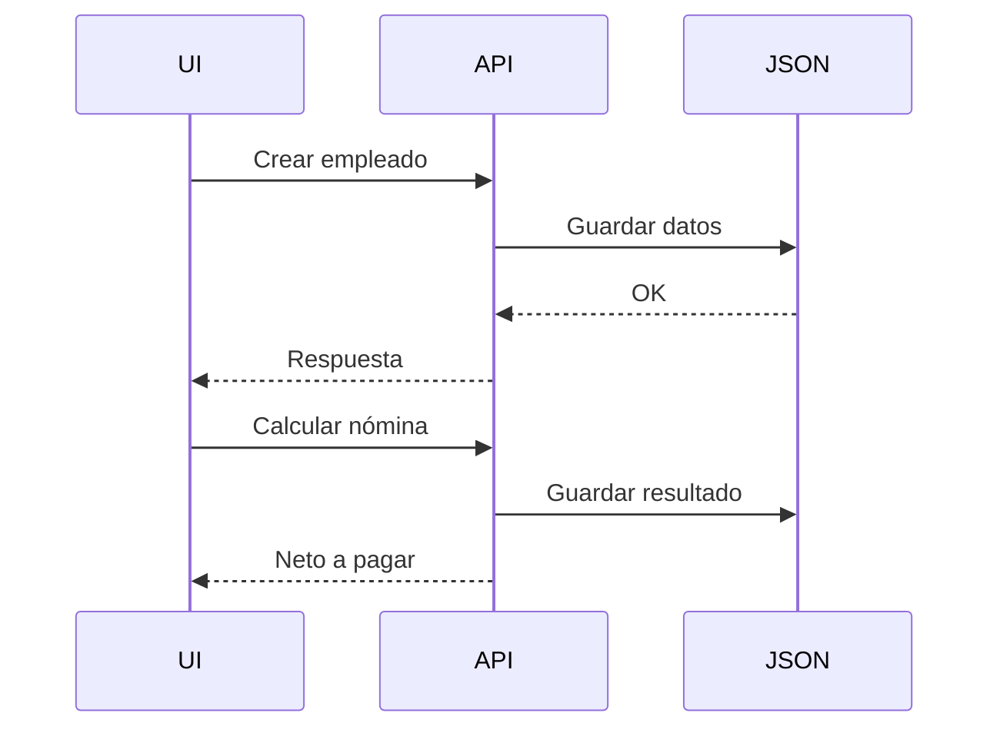

# 🧑‍💼 Sistema de Gestión de RRHH


Aplicación web para la gestión de empleados, cálculo de nómina, historial de cambios y auditoría, utilizando arquitectura modular en frontend y persistencia basada en archivos JSON.

---

## 📸 Screenshots

> 📌 **TIP:** Guarda tus imágenes en `/public/screenshots/`

### 🏠 Vista principal


### 👥 Lista de empleados



### 💰 Cálculo de nómina


### 📜 Historial de cambios


---

## 🧭 Demo

```bash
http://localhost:3000
```

---

## 🚀 Tecnologías

* ⚙️ Node.js + Express
* 🎨 Bootstrap 5
* 🧠 JavaScript (ES Modules)
* 💾 JSON como base de datos
* 🧾 PDFKit (generación de PDFs)

---

## 🏗️ Arquitectura

### 🔷 Diagrama general



---

### 🔷 Separación de responsabilidades

| Módulo  | Responsabilidad          |
| ------- | ------------------------ |
| app.js  | Controlador principal    |
| api.js  | Comunicación con backend |
| ui.js   | Renderizado UI           |
| Express | Lógica + persistencia    |

---

## 📁 Estructura del proyecto

```bash
public/
│
├── index.html
├── styles.css
├── app.js
│
└── modules/
    ├── api.js
    └── ui.js

server.js

data/
├── empleados.json
├── historial.json
├── nomina.json
└── auditoria_nomina.json
```

---

## ⚙️ Funcionalidades

### 👤 Gestión de empleados

* Crear, editar y eliminar empleados
* Visualización dinámica

### 📜 Historial de cambios

* Registro automático
* Comparación antes vs después

### 💰 Nómina

* Salario base
* Horas extras
* Bonos
* Deducciones

```math
Neto = Devengado - Deducciones
```

### 🧾 PDF

* Generación de desprendible

### 🕒 Auditoría

* Registro de cambios en nómina
* Comparación de recalculos

---

## 🔄 Flujo de la aplicación



---

## 💾 Persistencia

Se utiliza almacenamiento en archivos JSON:

* empleados.json
* historial.json
* nomina.json
* auditoria_nomina.json

Ejemplo:

```json
{
  "id": 1,
  "personales": {
    "nombre": "Juan"
  }
}
```

---

## 🧠 Ejemplo de uso

### Obtener empleados

```js
const empleados = await api.obtenerEmpleados();
```

### Renderizar UI

```js
ui.renderEmpleados(empleados, lista, select);
```

---

## ⚠️ Configuración importante

### 🔹 HTML

```html
<script type="module" src="./app.js"></script>
```

---

### 🔹 Express

```js
app.use(express.static('public'));
```

---

## 📦 Instalación

```bash
npm install
node server.js
```

Abrir:

```bash
http://localhost:3000
```

---

## 🧪 Posibles mejoras

* 🔐 Autenticación
* 🗄️ Base de datos real (MongoDB/MySQL)
* ⚛️ Migración a React
* 🎯 Eliminación de onclick (event delegation)
* 📊 Dashboard analítico

---

## 🏁 Conclusión

Proyecto completo de gestión RRHH que implementa:

✔ CRUD
✔ Auditoría
✔ Nómina
✔ PDF
✔ Arquitectura modular

Ideal como base para sistemas empresariales.

---

## 📄 Licencia

MIT License
