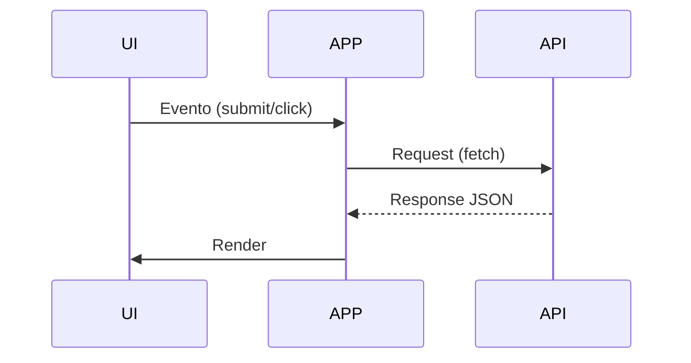
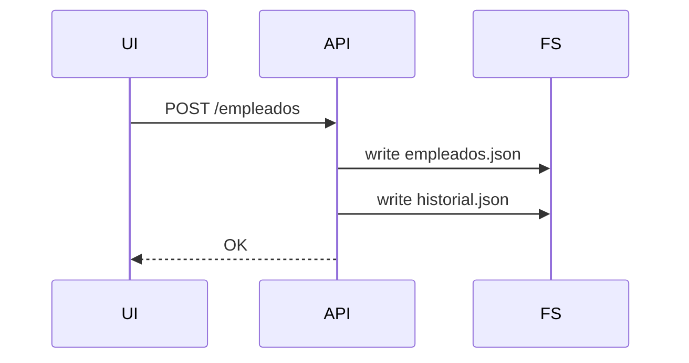
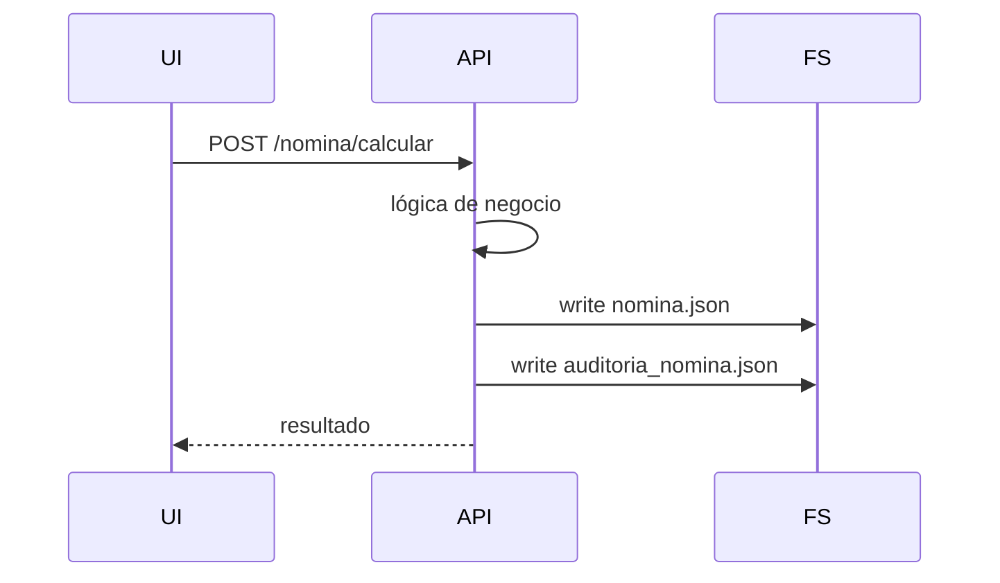

# 📘 INFO.md — Documentación Técnica (Nivel Senior)

## 🧑‍💻 Sistema de Gestión de RRHH

---

## 🎯 Objetivo del sistema

Aplicación web para la gestión de empleados, cálculo de nómina, auditoría de cambios y generación de reportes, implementando una arquitectura modular en frontend y persistencia basada en archivos JSON.

---

## 🏗️ Arquitectura General

### 🔷 Estilo arquitectónico

* Cliente-Servidor (SPA ligera)
* API REST (Express)
* Persistencia basada en archivos (File-based DB)

---

### 🔷 Diagrama de alto nivel

```mermaid
graph TD
UI[Frontend - Browser] --> APP[app.js]
APP --> API[api.js]
APP --> UI_LAYER[ui.js]

API --> SERVER[Express API]
SERVER --> FS[File System (JSON)]
```

---

## 🧩 Frontend Architecture

### 🔹 Patrón aplicado: Modular + Separation of Concerns

| Módulo | Responsabilidad      |
| ------ | -------------------- |
| app.js | Orquestación / flujo |
| api.js | Comunicación HTTP    |
| ui.js  | Renderización DOM    |

---

### 🔹 Flujo interno



---

### 🔹 Decisiones clave

#### ✔ Uso de ES Modules

* Permite separación real de lógica
* Evita contaminación global

#### ✔ Uso de `window` para handlers

* Trade-off: simplicidad vs desacoplamiento
* Se mantiene por compatibilidad con `onclick`

---

## 🌐 Backend Architecture

### 🔹 Stack

* Node.js
* Express

---

### 🔹 Endpoints principales

| Método | Endpoint                           | Descripción      |
| ------ | ---------------------------------- | ---------------- |
| GET    | /api/empleados                     | Listar empleados |
| POST   | /api/empleados                     | Crear            |
| PUT    | /api/empleados/:id                 | Editar           |
| DELETE | /api/empleados/:id                 | Eliminar         |
| GET    | /api/empleados/:id/historial       | Historial        |
| POST   | /api/nomina/calcular               | Calcular nómina  |
| GET    | /api/nomina/:id/:periodo/pdf       | PDF              |
| GET    | /api/nomina/:id/:periodo/auditoria | Auditoría        |

---

## 💾 Modelo de Persistencia

### 🔹 Estrategia

Persistencia basada en archivos JSON:

```bash
data/
├── empleados.json
├── historial.json
├── nomina.json
└── auditoria_nomina.json
```

---

### 🔹 Características

| Aspecto       | Evaluación |
| ------------- | ---------- |
| Simplicidad   | Alta       |
| Escalabilidad | Baja       |
| Concurrencia  | Limitada   |
| Mantenimiento | Medio      |

---

### 🔹 Trade-offs

**Ventajas:**

* Fácil implementación
* Sin dependencia externa
* Ideal para prototipos

**Desventajas:**

* No hay locking
* Riesgo de corrupción
* No soporta alta concurrencia

---

## 🔄 Flujo de Datos

### 🔹 Creación de empleado



---

### 🔹 Cálculo de nómina



---

## 🧠 Lógica de Negocio

### 🔹 Nómina

Componentes:

* Devengado:

  * Salario base
  * Horas extras
  * Bonos

* Deducciones:

  * Salud
  * Pensión
  * ARL
  * Fondo

Resultado:

```math
Neto = Devengado - Deducciones
```

---

### 🔹 Historial

Se almacena:

```json
{
  "antes": {...},
  "despues": {...},
  "fecha": "timestamp"
}
```

Comparación dinámica en frontend.

---

### 🔹 Auditoría

* Registro de recalculos
* Comparación de totales
* Trazabilidad completa

---

## ⚠️ Problemas Detectados (Pre-Refactor)

* Mezcla de responsabilidades (UI + lógica + API)
* Uso intensivo de `innerHTML`
* Eventos acoplados (`onclick`)
* Falta de manejo de errores robusto

---

## 🔧 Refactor Aplicado

### 🔹 Objetivos

* Separar responsabilidades
* Mejorar mantenibilidad
* Preparar escalabilidad

---

### 🔹 Cambios

| Antes             | Después              |
| ----------------- | -------------------- |
| app.js monolítico | arquitectura modular |
| fetch directo     | api.js               |
| render inline     | ui.js                |

---

## 🔒 Consideraciones de Seguridad

* ❌ No hay autenticación
* ❌ No hay validación robusta backend
* ❌ No hay sanitización HTML

---

## 📈 Escalabilidad

### 🔹 Limitaciones actuales

* File system como DB
* No hay cache
* No hay paginación

---

### 🔹 Evolución propuesta

1. Migrar a DB (MongoDB / PostgreSQL)
2. Implementar capas:

   * Controller
   * Service
   * Repository
3. Añadir autenticación (JWT)
4. Frontend SPA (React)

---

## 🧪 Testing (No implementado)

### Recomendado:

* Unit tests (Jest)
* API tests (Supertest)
* E2E (Playwright)

---

## 🚀 Roadmap Técnico

* [ ] Event Delegation (eliminar onclick)
* [ ] Manejo global de errores
* [ ] Logging estructurado
* [ ] Cache (Redis opcional)
* [ ] Dockerización

---

## 🏁 Conclusión Técnica

El sistema demuestra:

* Separación de responsabilidades
* Diseño modular
* Implementación de CRUD completo
* Manejo de auditoría y trazabilidad

Aunque limitado en escalabilidad, es una base sólida para evolucionar hacia una arquitectura empresarial.

---
