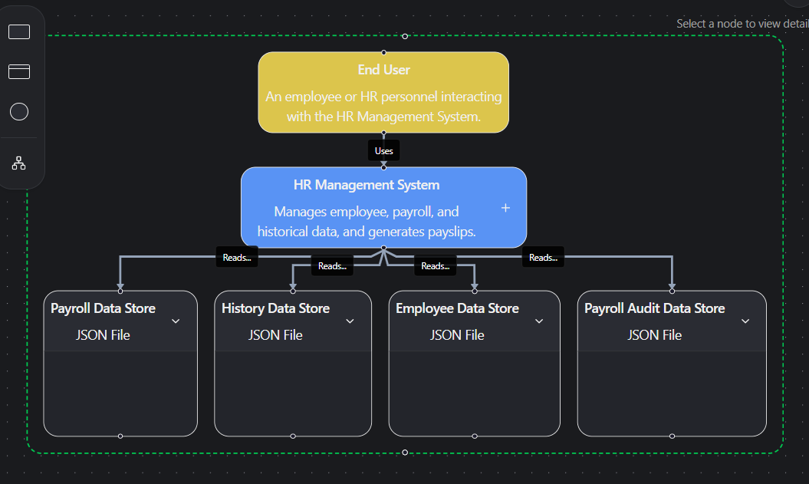
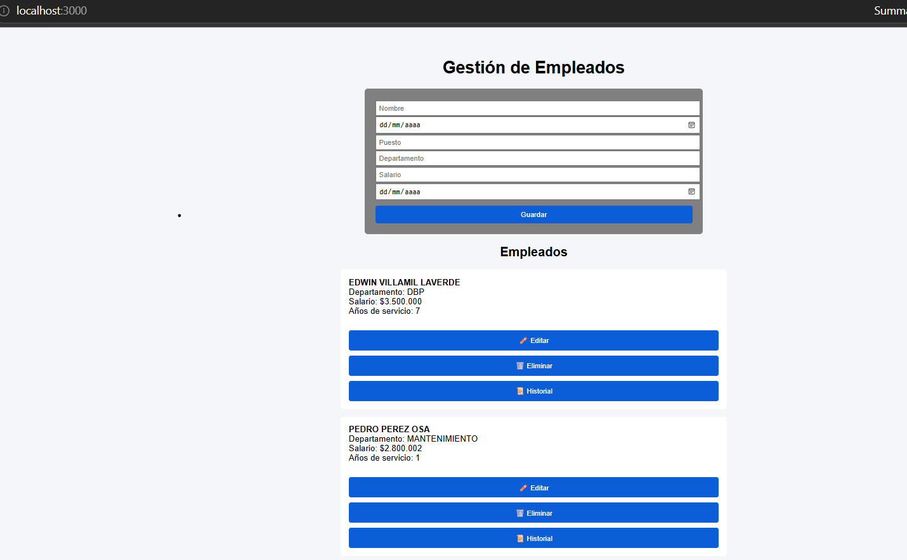
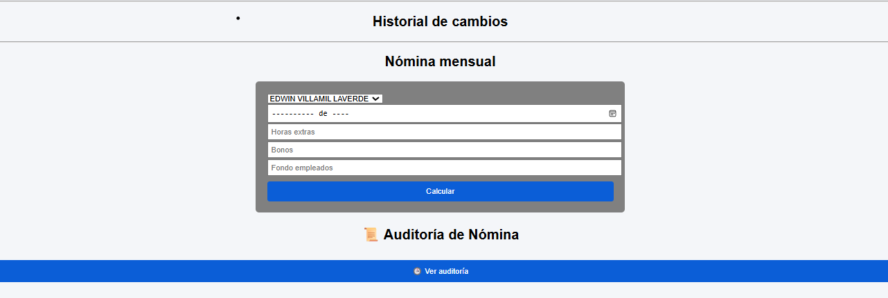

## Esta aplicación es un Demo de Nómina
Se inicia con node server.js

##Control de Versiones

Vers_02_Control_Nomina

Funcionalidad	                Estado
Recalcular nómina	            ✅
Sobrescribir antes del cierre	✅
Evitar duplicados	            ✅
Cierre de períodos	            ✅
Inmutabilidad post-cierre	    ✅
PDFs	                        ✅
Compatible con Vers_01




# 🧑‍💼 Sistema de Gestión de RRHH

Aplicación web para la gestión de empleados, cálculo de nómina, historial de cambios y auditoría.





---

## 🚀 Tecnologías utilizadas

* Node.js + Express
* JavaScript (Frontend)
* Bootstrap 5
* JSON como base de datos
* PDFKit (generación de reportes)

---

## 🏗️ Arquitectura

El sistema sigue una arquitectura cliente-servidor:

Frontend (public/)

* Render dinámico con JavaScript
* Comunicación vía fetch API

Backend (server.js)

* API REST
* Lógica de negocio
* Persistencia en archivos JSON

---

## 💾 Persistencia de datos

Los datos se almacenan en archivos JSON simulando una base de datos:

* empleados.json → Información principal
* historial.json → Cambios en empleados
* nomina.json → Cálculos de nómina
* auditoria_nomina.json → Auditoría de recalculos

---

## ⚙️ Funcionalidades

### 👤 Gestión de empleados

* Crear empleado
* Editar información
* Eliminar
* Visualizar listado

---

### 📜 Historial de cambios

Cada modificación guarda:

* Estado anterior
* Estado nuevo
* Fecha del cambio

---

### 💰 Cálculo de nómina

Permite calcular:

* Salario base
* Horas extras
* Bonos
* Deducciones (salud, pensión, ARL, fondo)

Resultado:

```
Neto = Devengado - Deducciones
```

---

### 🧾 Generación de PDF

Se genera un desprendible con:

* Datos del empleado
* Conceptos de nómina
* Total a pagar

---

### 🕒 Auditoría de nómina

Cada recalculo guarda:

* Antes vs Después
* Fecha
* Acción realizada

---

## 🔄 Flujo de la aplicación

1. Usuario crea empleado
2. Se guarda en JSON
3. Se puede editar → genera historial
4. Se calcula nómina
5. Se guarda resultado
6. Se auditan cambios

---

## 📦 Instalación

```bash
npm install
node server.js
```

Abrir en:

```
http://localhost:3000
```

---

## 🧠 Conceptos clave del proyecto

### 🔹 Render dinámico

Se crean elementos HTML desde JavaScript:

```js
lista.innerHTML += `<div>${empleado.nombre}</div>`;
```

---

### 🔹 Comunicación cliente-servidor

```js
fetch("/api/empleados")
  .then(res => res.json())
  .then(data => console.log(data));
```

---

### 🔹 Persistencia simple

```js
fs.writeFileSync("empleados.json", JSON.stringify(data));
```

---

## 🚧 Mejoras futuras

* Migrar a base de datos real (MySQL o MongoDB)
* Autenticación de usuarios
* Roles (Admin / RRHH)
* UI más avanzada (React o Vue)
* Cache y optimización

---

## 🏁 Conclusión

Este proyecto implementa un sistema completo de RRHH con:

✔ CRUD
✔ Auditoría
✔ Cálculo de nómina
✔ Generación de PDF

Sirve como base para sistemas empresariales reales.
