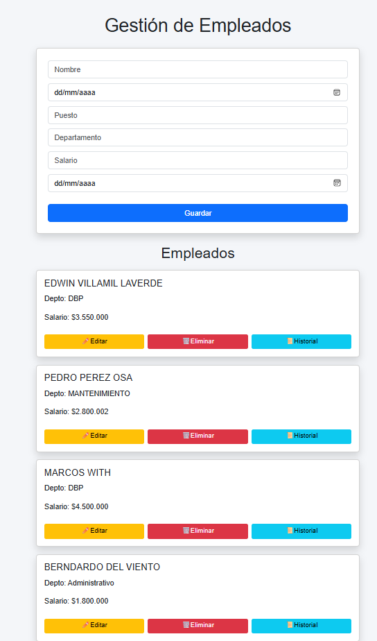

## Esta aplicación es un Demo de Nómina
Se inicia con node server.js

##Control de Versiones

Vers_02_Control_Nomina

Funcionalidad	                Estado
Recalcular nómina	            ✅
Sobrescribir antes del cierre	✅
Evitar duplicados	            ✅
Cierre de períodos	            ✅
Inmutabilidad post-cierre	    ✅
PDFs	                        ✅
Compatible con Vers_01


---
# 🧑‍💼 Sistema de Gestión de RRHH

Aplicación web para la gestión de empleados, cálculo de nómina, historial de cambios y auditoría, utilizando una arquitectura modular en frontend y persistencia basada en archivos JSON en backend.



---

## 🚀 Tecnologías utilizadas

* Node.js + Express
* JavaScript (ES Modules)
* Bootstrap 5
* JSON como base de datos
* PDFKit (generación de reportes)

---

## 🏗️ Arquitectura del proyecto

El sistema sigue una arquitectura cliente-servidor:

### 🔹 Frontend (public/)

* `index.html` → Interfaz de usuario (Bootstrap)
* `app.js` → Controlador principal (orquestador)
* `modules/api.js` → Manejo de llamadas HTTP (fetch)
* `modules/ui.js` → Renderizado de la interfaz

### 🔹 Backend (server.js)

* API REST
* Lógica de negocio
* Persistencia en archivos JSON

---

## 📁 Estructura del proyecto

```
public/
│
├── index.html
├── styles.css
├── app.js
│
└── modules/
    ├── api.js
    └── ui.js

server.js
empleados.json
historial.json
nomina.json
auditoria_nomina.json
```

---

## 💾 Persistencia de datos

Se utiliza almacenamiento en archivos JSON, simulando una base de datos:

* `empleados.json` → Información principal de empleados
* `historial.json` → Cambios realizados sobre empleados
* `nomina.json` → Cálculos de nómina
* `auditoria_nomina.json` → Auditoría de recalculos

---

## ⚙️ Funcionalidades

### 👤 Gestión de empleados

* Crear empleado
* Editar información
* Eliminar empleado
* Listar empleados

---

### 📜 Historial de cambios

* Registro automático de modificaciones
* Comparación "antes vs después"

---

### 💰 Cálculo de nómina

Permite calcular:

* Salario base
* Horas extras
* Bonos
* Deducciones (salud, pensión, ARL, fondo)

Resultado:

```
Neto = Devengado - Deducciones
```

---

### 🧾 Generación de PDF

* Desprendible de nómina
* Información detallada del empleado

---

### 🕒 Auditoría de nómina

* Registro de recalculos
* Comparación de cambios
* Historial por período

---

## 🔄 Flujo de la aplicación

1. Usuario crea o edita empleado
2. Se guarda en JSON mediante API
3. Se registra historial de cambios
4. Se calcula nómina
5. Se guarda resultado
6. Se auditan cambios

---

## 🧠 Conceptos clave implementados

### 🔹 Arquitectura modular (Frontend)

Separación de responsabilidades:

* `api.js` → Comunicación con backend
* `ui.js` → Render HTML
* `app.js` → Control de flujo

Ejemplo:

```js
import { api } from './modules/api.js';
import { ui } from './modules/ui.js';

const empleados = await api.obtenerEmpleados();
ui.renderEmpleados(empleados, contenedor);
```

---

### 🔹 Render dinámico

Se generan elementos HTML desde JavaScript:

```js
contenedor.innerHTML += `<div>${empleado.nombre}</div>`;
```

---

### 🔹 Comunicación cliente-servidor

```js
fetch("/api/empleados")
  .then(res => res.json())
  .then(data => console.log(data));
```

---

### 🔹 Persistencia simple (backend)

```js
fs.writeFileSync("empleados.json", JSON.stringify(data, null, 2));
```

---

## ⚠️ Requisitos importantes

### 🔹 Uso de módulos ES

En `index.html`:

```html
<script type="module" src="./app.js"></script>
```

---

### 🔹 Servidor Express

Debe servir la carpeta `public`:

```js
app.use(express.static('public'));
```

---

## 📦 Instalación

```bash
npm install
node server.js
```

Abrir en navegador:

```
http://localhost:3000
```

---

## 🚧 Mejoras futuras

* Migración a base de datos real (MySQL / MongoDB)
* Autenticación de usuarios
* Roles (Admin / RRHH)
* Eliminación de `onclick` (event delegation)
* UI avanzada (React / Vue)
* Validaciones frontend más robustas

---

## 🏁 Conclusión

Este proyecto implementa un sistema completo de gestión de RRHH con:

✔ CRUD de empleados
✔ Auditoría de cambios
✔ Cálculo de nómina
✔ Generación de PDF
✔ Arquitectura modular

Sirve como base para evolucionar hacia aplicaciones empresariales reales.

---
